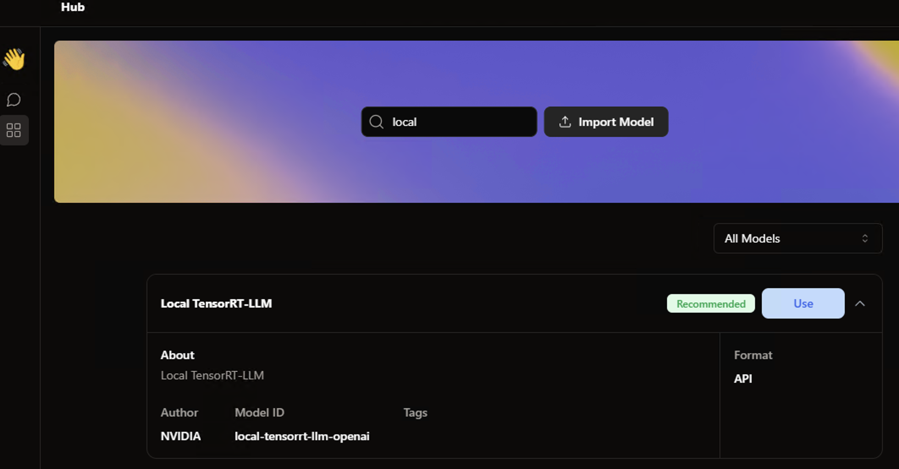
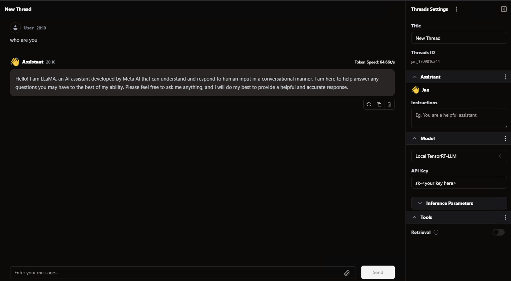
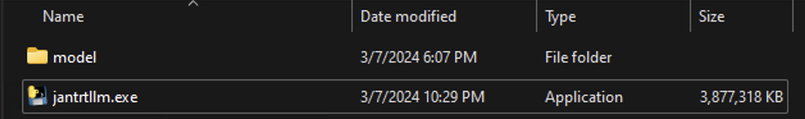

# Jan Integration with TensoRT-LLM on Windows machines

In this note, I will share about Jan integration with TensorRT-LLM on Windows

- [Windows Bare-Metal](#windows-bare-metal)
- [Windows Container](#windows-container)
- [Windows 1-click installer](#windows-1-click-installer)

## Preparation for TensorRT-LLM

### Windows Bare-Metal

- Given the excellent documentation at [README from NVIDIA team](./README.md), here is the steps:
- [ ] Step 1. Download external dependencies (Can follow this [documentation in TensorRT-LLM 0.7.1](https://github.com/NVIDIA/TensorRT-LLM/tree/v0.7.1/windows#quick-start))
  - [ ] Step 3.1: Run [setup_env.ps1](https://github.com/NVIDIA/TensorRT-LLM/blob/v0.7.1/windows/setup_env.ps1) to install CUDA 12, Python 3.10 and Microsoft MPI
  - [ ] Step 3.2: Download [TensorRT 9.2.0.5](https://developer.nvidia.com/downloads/compute/machine-learning/tensorrt/9.2.0/tensorrt-9.2.0.5.windows10.x86_64.cuda-12.2.llm.beta.zip), unzip it and run `setx Path "%Path%;C:\<specific_path>\TensorRT-9.2.0.5\lib"` in order for `TensorRT-LLM` to be able to use. Then run `pip install TensorRT-9.2.0.5\python\tensorrt-9.2.0.post12.dev5-cp310-none-win_amd64.whl` to install Python TensorRT. Test the installation by running `python -c "import tensorrt as trt; print(trt.__version__)"`
  - [ ] Step 3.3: Install TensorRT-LLM by running quick command `pip install tensorrt_llm==0.7.1 --extra-index-url https://pypi.nvidia.com  --extra-index-url https://download.pytorch.org/whl/cu121` and verify the installation by running `python -c "import tensorrt_llm; print(tensorrt_llm._utils.trt_version())"`
- Step 2: Download model tokenizer and checkpoint. In this document, let's try to put up the `Llama2 13B chat hf INT4` model:
  - [ ] Step 2.1: Download tokenizer related files from [Llama2 13B chat hf chat](https://huggingface.co/meta-llama/Llama-2-13b-chat-hf/tree/main) with files: `config.json`, `tokenizer.config`, `tokenizer.json` and `tokenizer.model`. Put it in `model\llama2_13b_chat\tokenizer` folder
  - [ ] Step 2.2: Download checkpoint NVIDIA shared on NGC for [LLama2 13B HF Chat INT4 checkpoint version 1.3](https://catalog.ngc.nvidia.com/orgs/nvidia/models/llama2-13b/files?version=1.3) with 2 files `llama_tp1.json` and `llama_tp1_rank0.npz` as checkpoint to `model\llama2_13b_chat\ckpt_int4`. The way to create this from scratch is [here for Llama based model](https://github.com/NVIDIA/TensorRT-LLM/tree/main/examples/llama#llama-v2-updates).
- Step 3: Build the model engine so that TensorRT-LLM can load with
  - `model_dir`: This is the tokenizer we downloaded in step 2.1 (`model\llama2_13b_chat\tokenizer`)
  - `quant_ckpt_path`: This is the path to ckpt we download in step 2.2 (`model\llama2_13b_chat\ckpt_int4`)
  - `output_dir`: This is the path to output dir for built model engine (`model\llama2_13b_chat\engine`) with 3 file: `config.json`, `llama_float16_tp1_rank0.engine` and `model.cache`

```bat
python build.py --model_dir <> --quant_ckpt_path <> --dtype float16 --use_gpt_attention_plugin float16 --use_gemm_plugin float16 --use_weight_only --weight_only_precision int4_awq --per_group --enable_context_fmha --max_batch_size 1 --max_input_len 3500 --max_output_len 1024 --output_dir <>
```

- Step 4: Once we have secure the `.engine` file, let's put up the webserver
  - [ ] Step 4.1. Install project dependencies by `pip install -r requirements.txt`
  - [ ] Step 4.2. Run the webserver by: `python app.py --trt_engine_path model\engine --trt_engine_name llama_float16_tp1_rank0.engine --tokenizer_dir_path model\tokenizer --port 8080`
  - [ ] Step 4.3. Verify the the API

```bat
curl --location 'http://localhost:8080/chat/completions' \
--header 'Content-Type: application/json' \
--header 'Accept: */*' \
--header 'Access-Control-Allow-Origin: *' \
--data '{
    "messages": [
        {
            "content": "Please write a long and sad story",
            "role": "user"
        }
    ],
    "stream": true,
    "model": "gpt-3.5-turbo",
    "max_tokens": 2000
}'

curl --location 'http://localhost:8080/chat/completions' \
--header 'Content-Type: application/json' \
--header 'Accept: */*' \
--header 'Access-Control-Allow-Origin: *' \
--data '{
    "messages": [
        {
            "content": "Please write a long and sad story",
            "role": "user"
        }
    ],
    "stream": false,
    "model": "gpt-3.5-turbo",
    "max_tokens": 2000
}'
```

- Step 5: Test the local API with Jan
  - [ ] Step 5.1: Download Jan at https://jan.ai/
  - [ ] Step 5.2: Update the app in order to use localhost API
    - Update `C:\Users\<username>\jan\engines\openai.json` as follow in order to connect to the API server we have in step 4
    ```json
    {
      "full_url": "http://127.0.0.1:8080/v1/chat/completions",
      "api_key": "sk-<your key here>"
    }
    ```
    - Create new model to use this by creating a new folder with name as `local-tensorrt-llm-openai` in `C:\Users\<username>\jan\models\` and a `model.json` in `C:\Users\<username>\jan\models\local-tensorrt-llm-openai`
    ```json
    {
      "sources": [
        {
          "url": "https://127.0.0.1:8080/models"
        }
      ],
      "id": "local-tensorrt-llm-openai",
      "object": "model",
      "name": "Local TensorRT-LLM",
      "version": "1.0",
      "description": "Local TensorRT-LLM",
      "format": "api",
      "settings": {},
      "parameters": {
        "max_tokens": 4096,
        "temperature": 0.7
      },
      "metadata": {
        "author": "NVIDIA",
        "tags": []
      },
      "engine": "openai"
    }
    ```
- Open the app, go to Hub and choose `Local TensorRT-LLM` to use
  
- Try to chat with the local model, the performance is impressive with the model on NVIDIA 3090 24GB VRAM (64.66 token/s). The VRAM usage is around 95%.
  

### Windows Container

- Step 1: Prepare Docker Desktop on Windows
  - Download the Docker Desktop from [Docker Desktop for Windows](https://docs.docker.com/desktop/install/windows-install/)
  - Check for Hyper-V support, please refer to this [documentation on windows 11](https://techcommunity.microsoft.com/t5/educator-developer-blog/step-by-step-enabling-hyper-v-for-use-on-windows-11/ba-p/3745905)
  - Right click the Docker icon in the Windows system tray (bottom right of your taskbar) and select "Switch to Windows containers..."
  - In Docker Desktop settings on the General tab, uncheck "Use the WSL 2 based image"
  - On the Docker Engine tab, set you configuration file to
  ```json
  {
    "experimental": true
  }
  ```
- Step 2: Run `docker build tensorrt_llm_windows .`. This will prepare the environment for `TensorRT-LLM` automatically. See [Dockerfile](./Dockerfile)
- Step 3: Run `docker run -ti -p 8080:8080 tensorrt_llm_windows`. This will run `entrypoint.ps1` by default to install `tensorrt_llm` here because `tensorrt_llm` python installation requires GPU access, only `docker run` can provide it

  - There is a bug here that the author discover

    - The `pip install tensorrt_llm==0.7.1 --extra-index-url https://pypi.nvidia.com  --extra-index-url https://download.pytorch.org/whl/cu121` will yield bug once we try to import `tensorrt_llm` in python runtime because the `nvinfer_plugin_tensorrt_llm.dll` is not for `windows servercore`. This error only happens in `windows servercore` docker image for [ctypes.CDLL](https://github.com/NVIDIA/TensorRT-LLM/blob/728cc0044bb76d1fafbcaa720c403e8de4f81906/tensorrt_llm/plugin/plugin.py#L43) with the error: FileNotFound (even though the author `cd` into the folder and load without any path, it still yields this issue). Author is still fixing it
    - The author tried to compile the python wheel from source by using the below command but has error to be fixed

    ```bat
        git clone https://github.com/NVIDIA/TensorRT-LLM.git
        cd TensorRT-LLM
        git submodule update --init --recursive

        # 80-real for 3090
        # 89-real for 4090
        python .\scripts\build_wheel.py -a "80-real" --trt_root C:\workspace\TensorRT-9.2.0.5\
    ```

    - The error is in CMAKE. The author is trying to fix at the moment

    ````
     CMake Error: CMake was unable to find a build program corresponding to "Ninja".  CMAKE_MAKE_PROGRAM is not set.  You probably need to select a different build tool.
         CMake Error: CMAKE_CXX_COMPILER not set, after EnableLanguage
         -- Configuring incomplete, errors occurred!
         Traceback (most recent call last):
         File "C:\workspace\TensorRT-LLM\scripts\build_wheel.py", line 324, in <module>
             main(**vars(args))
         File "C:\workspace\TensorRT-LLM\scripts\build_wheel.py", line 162, in main
             build_run(
         File "C:\Program Files\Python310\lib\subprocess.py", line 526, in run
             raise CalledProcessError(retcode, process.args,
         subprocess.CalledProcessError: Command 'cmake -DCMAKE_BUILD_TYPE="Release" -DBUILD_PYT="ON" -DBUILD_PYBIND="ON" -DNVTX_DISABLE="ON" "-DCMAKE_CUDA_ARCHITECTURES=80-real" "-DENABLE_MULTI_DEVICE=0"
         -DTRT_LIB_DIR=C:/workspace/app/TensorRT-9.2.0.5/lib -DTRT_INCLUDE_DIR=C:/workspace/app/TensorRT-9.2.0.5/include -GNinja -S "C:\workspace\TensorRT-LLM\cpp"' returned non-zero exit status 1.
     ```
    - After this step, the expectation is that:
    - The container runs smoothly, compile the engine at runtime to prevent regression cases
    - The API opens up at port `8080`
    ````

- Step 4: We can follow `Step 5` as above to use Jan

### Windows 1-click installer

- The author has tried to package the environment that he has successfully run in [Windows Bare-Metal](#windows-bare-metal) with `pyinstaller`. However currently it's not possible to run because `PyInstaller`cannot package `nvinfer_plugin_tensorrt_llm.dll` with other files.
- The expected guide to run this one should be neat and very simple because there is an `.exe` file and a model folder so that we can swap any model engine
  
- Steps to reproduce:

  - Step 1: Install pyinstaller by `pip install pyinstaller`
  - Step 2: Run package command

  ```bat
    pyinstaller --onefile --name jantrtllm --add-binary=".\\dll\\cublas64_12.dll;." --add-binary=".\\dll\\cublasLt64_12.dll;." --add-binary=".\\dll\\cudart64_12.dll;." --add-binary=".\\dll\\nvinfer_builder_resource.dll;." --add-binary=".\\dll\\nvinfer_plugin.dll;." --add-binary=".\\dll\\nvinfer_plugin.lib;." --add-binary=".\\dll\\nvinfer.dll;." --add-binary=".\\dll\\nvinfer.lib;." --add-binary=".\\dll\\nvinfer_plugin_tensorrt_llm.dll;."  --hidden-import=cuda.cuda  --hidden-import=cuda._lib --hidden-import=cuda._lib.utils --hidden-import=cuda.ccuda --hidden-import=cuda._cuda --hidden-import=cuda._cuda.ccuda --hidden-import=cuda.ccudart  --hidden-import=cuda._lib.ccudart --hidden-import=cuda._lib.ccudart.utils --hidden-import=cuda._lib.ccudart.ccudart app.py
  ```

  - The current error for including `--add-binary=".\\dll\\nvinfer_plugin_tensorrt_llm.dll;."`. The author has hypothesis that this binary is big (close to 1GB). The author tried to include another `.dll` and still work well. The error now is

  ```bat
  Traceback (most recent call last):
      File "C:\Users\HOME\AppData\Local\NVIDIA\MiniConda\envs\tensorrtllm\lib\runpy.py", line 196, in _run_module_as_main
          return _run_code(code, main_globals, None,
      File "C:\Users\HOME\AppData\Local\NVIDIA\MiniConda\envs\tensorrtllm\lib\runpy.py", line 86, in _run_code
          exec(code, run_globals)
      File "C:\Users\HOME\AppData\Local\NVIDIA\MiniConda\envs\tensorrtllm\Scripts\pyinstaller.exe\__main__.py", line 7, in <module>
      File "C:\Users\HOME\AppData\Local\NVIDIA\MiniConda\envs\tensorrtllm\lib\site-packages\PyInstaller\__main__.py", line 228, in _console_script_run
          run()
      File "C:\Users\HOME\AppData\Local\NVIDIA\MiniConda\envs\tensorrtllm\lib\site-packages\PyInstaller\__main__.py", line 212, in run
          run_build(pyi_config, spec_file, **vars(args))
      File "C:\Users\HOME\AppData\Local\NVIDIA\MiniConda\envs\tensorrtllm\lib\site-packages\PyInstaller\__main__.py", line 69, in run_build
          PyInstaller.building.build_main.main(pyi_config, spec_file, **kwargs)
      File "C:\Users\HOME\AppData\Local\NVIDIA\MiniConda\envs\tensorrtllm\lib\site-packages\PyInstaller\building\build_main.py", line 1091, in main
          build(specfile, distpath, workpath, clean_build)
      File "C:\Users\HOME\AppData\Local\NVIDIA\MiniConda\envs\tensorrtllm\lib\site-packages\PyInstaller\building\build_main.py", line 1031, in build
          exec(code, spec_namespace)
      File "C:\Users\HOME\Documents\trt_env\trt-llm-as-openai-windows-release-1.0\jantrtllm.spec", line 18, in <module>
          exe = EXE(
      File "C:\Users\HOME\AppData\Local\NVIDIA\MiniConda\envs\tensorrtllm\lib\site-packages\PyInstaller\building\api.py", line 609, in __init__
          self.pkg = PKG(
      File "C:\Users\HOME\AppData\Local\NVIDIA\MiniConda\envs\tensorrtllm\lib\site-packages\PyInstaller\building\api.py", line 238, in __init__
          self.__postinit__()
      File "C:\Users\HOME\AppData\Local\NVIDIA\MiniConda\envs\tensorrtllm\lib\site-packages\PyInstaller\building\datastruct.py", line 184, in __postinit__
          self.assemble()
      File "C:\Users\HOME\AppData\Local\NVIDIA\MiniConda\envs\tensorrtllm\lib\site-packages\PyInstaller\building\api.py", line 329, in assemble
          CArchiveWriter(self.name, bootstrap_toc + archive_toc, pylib_name=self.python_lib_name)
      File "C:\Users\HOME\AppData\Local\NVIDIA\MiniConda\envs\tensorrtllm\lib\site-packages\PyInstaller\archive\writers.py", line 146, in __init__
          toc_data = self._serialize_toc(toc)
      File "C:\Users\HOME\AppData\Local\NVIDIA\MiniConda\envs\tensorrtllm\lib\site-packages\PyInstaller\archive\writers.py", line 282, in _serialize_toc
          serialized_entry = struct.pack(
      struct.error: argument out of range
  ```

  - The current error (before trying to add `` to the package) is

  ```bat
  Traceback (most recent call last):
      File "PyInstaller\loader\pyimod03_ctypes.py", line 53, in __init__
      File "ctypes\__init__.py", line 374, in __init__
      FileNotFoundError: Could not find module 'C:\Users\HOME\AppData\Local\Temp\_MEI53242\tensorrt_llm\libs\nvinfer_plugin_tensorrt_llm.dll' (or one of its dependencies). Try using the full path with constructor syntax.

      The above exception was the direct cause of the following exception:

      Traceback (most recent call last):
      File "app.py", line 25, in <module>
      File "<frozen importlib._bootstrap>", line 1027, in _find_and_load
      File "<frozen importlib._bootstrap>", line 1006, in _find_and_load_unlocked
      File "<frozen importlib._bootstrap>", line 688, in _load_unlocked
      File "PyInstaller\loader\pyimod02_importers.py", line 419, in exec_module
      File "trt_llama_api.py", line 31, in <module>
      File "<frozen importlib._bootstrap>", line 1027, in _find_and_load
      File "<frozen importlib._bootstrap>", line 1006, in _find_and_load_unlocked
      File "<frozen importlib._bootstrap>", line 688, in _load_unlocked
      File "PyInstaller\loader\pyimod02_importers.py", line 419, in exec_module
      File "tensorrt_llm\__init__.py", line 61, in <module>
      File "tensorrt_llm\_common.py", line 47, in _init
      File "tensorrt_llm\plugin\plugin.py", line 34, in _load_plugin_lib
      File "PyInstaller\loader\pyimod03_ctypes.py", line 55, in __init__
      pyimod03_ctypes.install.<locals>.PyInstallerImportError: Failed to load dynlib/dll 'C:\\Users\\HOME\\AppData\\Local\\Temp\\_MEI53242\\tensorrt_llm\\libs\\nvinfer_plugin_tensorrt_llm.dll'. Most likely this dynlib/dll was not found when the application was frozen.
      [12764] Failed to execute script 'app' due to unhandled exception!
  ```
